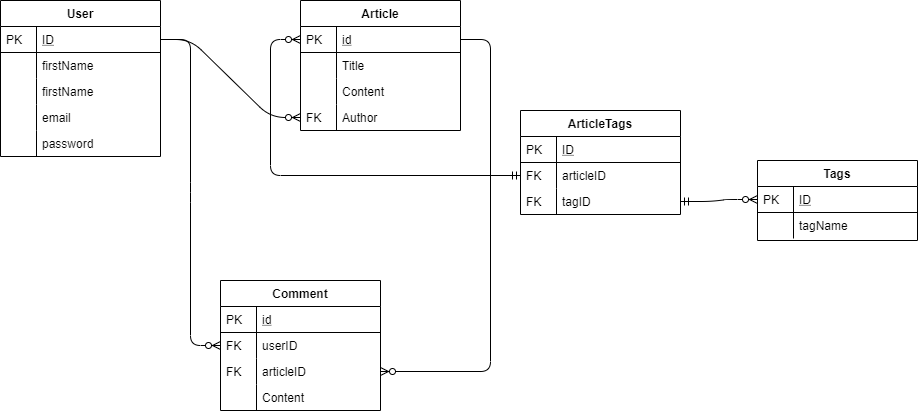

# API REST en NodeJS



Este es un pequeño servidor JSON REST hecho en NodeJS con Sequelize y Postgres. El servidor maneja información sobre usuarios, artículos y comentarios para un pequeño blog.

## Instalación

Clone el repositorio, y en la raíz cree un archivo .env con los siguientes valores:
```
PGUSER= Usuario de postgres
PGHOST= host de postgres
PGPASSWORD= Contraseña de la base de datos
PGDATABASE= Nombre de la base de datos
PGPORT= Puerto de la base de datos

SERVER_HOST = Nombre del host (localhost)
SERVER_PORT = puerto del host
```

Luego, ejecute los siguientes comandos:
```
    npm install
    npm run migrate
```

Y para ejecutar el servidor, los comandos son los siguientes:
```
    npm run dev  //Ejecutar en modo de desarrollo
    npm run prod //Ejecutar en modo de producción
```

## Pruebas de integración

Para ejecutar las pruebas, usa el siguiente comando:
```
npm test
```